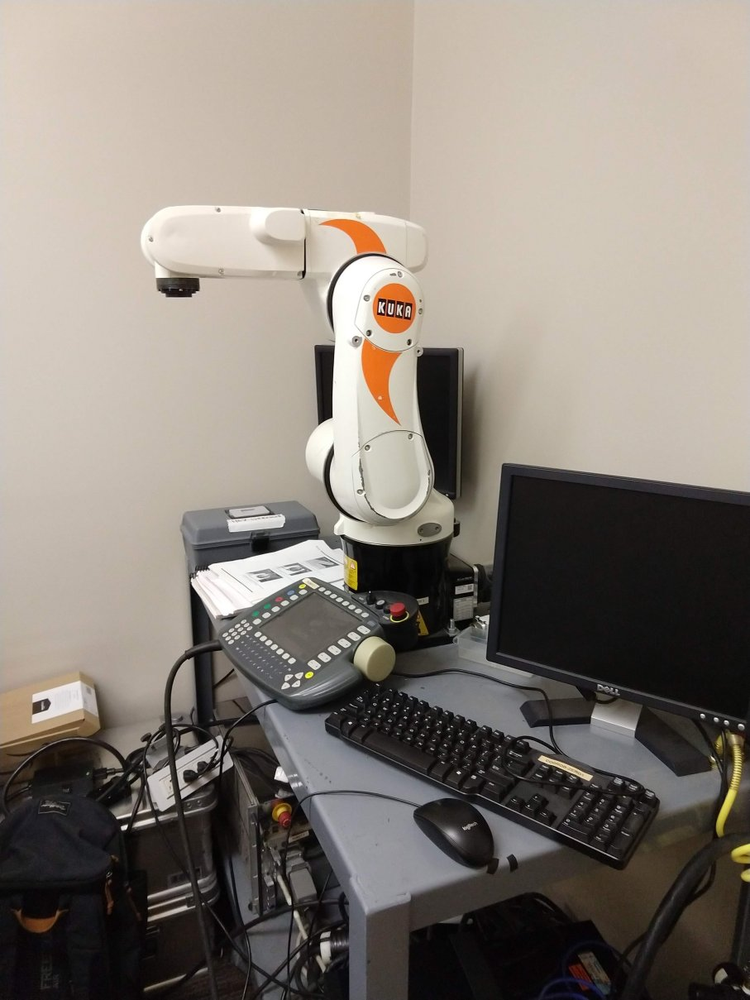
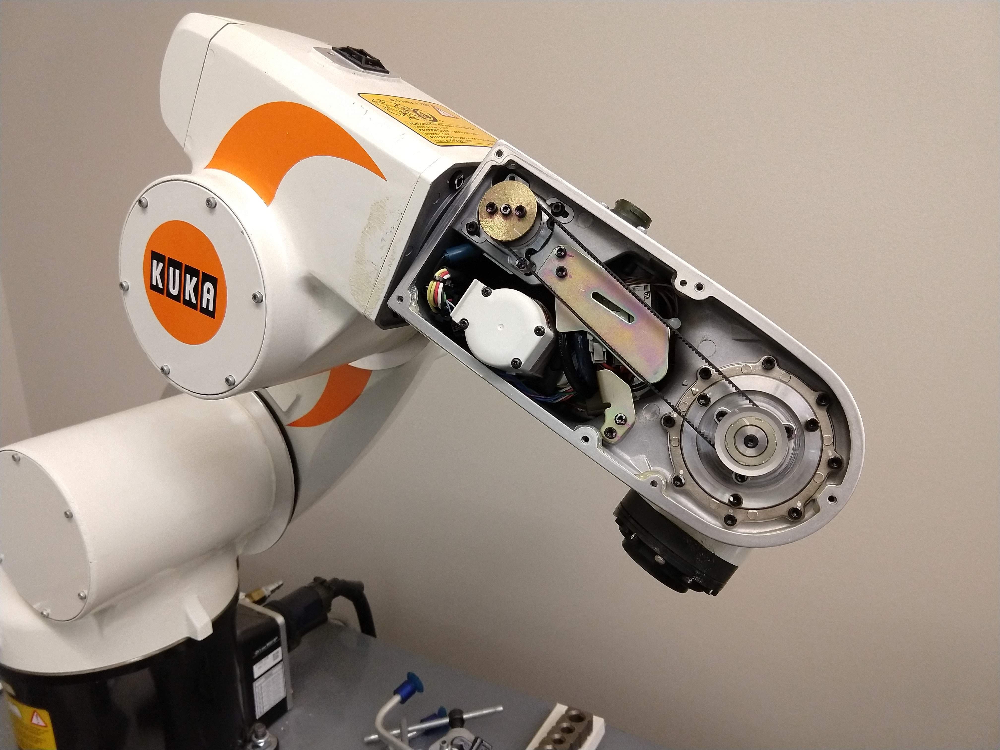
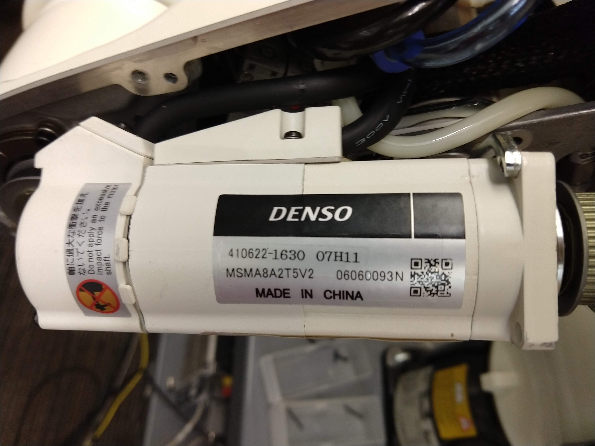

# Kuka Arm Documentation

## Patrick Grady, Sept 2019

 
 
There are two Kuka KR5 sixx R650 robots belonging to Dr Gombolay in CCB 2nd floor. The were inherited, and previously belonged to Henrik Christensen's lab, where Andrew Price was the main user. There are two robots, serial number 948035 (robot 1) and 948034 (robot 2).  
 
# Setup
 
## Fixing Axis 5
 
BOTH robots were broken when I first found them. Their axis 5 motors were broken, apparently due to the previous user slamming the end effector into the table repeatedly. From the pendant, I could move all other axes independently, but axis 5 would error out. It took a lot of debugging to find out what was wrong, and a lot of bravery to take apart the robot enough to get the motor out.

However, I bought a new A5 motor from ebay for $500, replaced it on Robot 1, and it worked. If you need to do this to Robot 2, please call me. There's a lot more to it.

 

 

## Power

The robots need 220v split phase power at 20 amps. This requires a special outlet. The robot's power cord has a NEMA L6-20 plug (L for locking), while the wall in the room had a NEMA 6-20 receptacle. Thus an adapter is required, which I found on Amazon.

## RSI

While academia has standardized on ROS to communicate between robots, unfortunately this is industrial robotics, which isn't quite so standardized. Especially because these robots are from 2006, and they use the previous generation controller, the KRC 2

This is a quick summary, but there are two methods to get networked control of the robots, RSI and EKI. Apparently EKI is for higher-level control, but as the previous users of the robot wanted to do really low-level impedance control, they used RSI. In this protocol, XML messages are passed over the network very rapidly to tell the robot what to do. RSI will also crash if it doesn't get a message every 10ms, so your computer must not hang or pause, as the connection will drop.

We will be using the ROS/RSI driver from G.A. vd. Hoorn. He has written a very nice package, kuka_experiemntal, a ROS package for ROS Industrial. 

http://wiki.ros.org/kuka_experimental
https://github.com/ros-industrial/kuka_experimental/tree/indigo-devel/kuka_rsi_hw_interface/krl/KR_C2

There are instructions to follow in his github of how to setup the packages. However, assuming the PC I was using is still there and hasn't been messed with, you won't need to set this up.

## Networking

Both the robot and the PC need to be plugged into the same router.

IP of PC, set via DHCP tables in router, is 192.168.1.42
IP of Robot 1, set via static IP settings on Windows, is xxxxxxxxx

# Getting the Robots to Run

###Bootup
Turn on the robot controller. For robot 1, you will need to plug in an external monitor to the pendant's screen doesn't work. It may get stuck at the BIOS on bootup, in which case you will need to plug in a keyboard to acknowledge the errors with F1. Bootup takes >5 minutes. Once booted, the controller may throw “robot type setting error” on the pendant, in the message screen at the bottom. Another shutdown-startup cycle should fix this.

Turn the PC on.

###Setup Kuka

1. During your testing, the robot should be in T1 mode. This is set by the key selector switch at the to right corner of the robot. This mode requires that the deadman's switch is held down for the robot to move

2. Make sure both E-stop switches are armed. One on pendant and one on controller

3. Enter administrator mode on the robot. This is done with Configure -> User Group -> Administrator (password is kuka)

4. Turn the Kuka web socket on. Go to Monitor -> I/O -> Digital Output. You want to turn on RSI_ETH. Hold the deadmans, and press "value".

5. Open the PC RSI Host.

# FAQ

### The robot says "Perform Mastering A1, A2, etc"

You turned the robot off without the backup battery being charged (I think). The process to master the robot (correlating motor encoder position to robot physical position) is described in BA_KR_5_sixx_WP_en.pdf. It takes about 20 minutes, and requires a special "mastering plate", which is in a small white box near the robot.

### What is the password?

The administrator password to the robot and to the PC are "kuka"